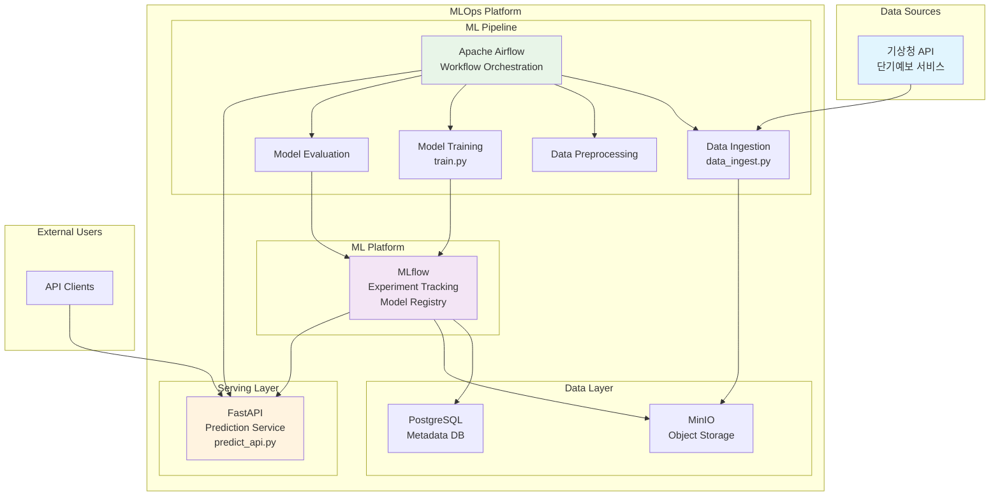

# 날씨 예측 MLOps 시스템

<br>

## 💻 프로젝트 소개
### <프로젝트 소개>
- 기상청 단기예보 API를 활용한 24시간 후 온도 예측 MLOps 파이프라인 프로젝트
- Apache Airflow를 사용한 자동화된 ML 워크플로우 구축
- MLflow를 통한 실험 관리 및 모델 버전 관리
- FastAPI를 통한 실시간 예측 서비스 제공

### <작품 소개>
- 실시간 기상 데이터 수집부터 모델 훈련, 배포, 서빙까지의 완전한 MLOps 파이프라인
- LightGBM을 활용한 기계학습 모델로 서울 지역 24시간 후 온도 예측
- Docker Compose를 통한 마이크로서비스 아키텍처 구현

<br>

## 👨‍👩‍👦‍👦 팀 구성원

|  |  |  |  |  |
| :--------------------------------------------------------------: | :--------------------------------------------------------------: | :--------------------------------------------------------------: | :--------------------------------------------------------------: | :--------------------------------------------------------------: |
|            [류지헌](https://github.com/mahomi)             |            [김태현](https://github.com/huefilm)             |            [박성진](https://github.com/psj2024p)             |            [채병기](https://github.com/avatar196kc)             |            [이준석](https://github.com/Lee-0624)             |
|                            팀장(ML엔지니어)                             |                            ML엔지니어                             |                            ML엔지니어                             |                            ML엔지니어                             |                            ML엔지니어                             |
<br>

## 🔨 개발 환경 및 기술 스택
- **주 언어**: Python 3.11
- **ML 프레임워크**: LightGBM, MLflow
- **워크플로우 오케스트레이션**: Apache Airflow
- **API 프레임워크**: FastAPI
- **데이터베이스**: PostgreSQL
- **객체 스토리지**: MinIO
- **컨테이너화**: Docker, Docker Compose
- **버전 관리**: Git, GitHub
- **협업 툴**: GitHub, Notion

<br>

## 📁 프로젝트 구조
```
├── src/
│   ├── data_ingest.py      # 기상청 API 데이터 수집
│   ├── train.py           # LightGBM 모델 훈련
│   └── predict_api.py     # FastAPI 예측 서비스
├── dags/
│   └── weather_forecast_dag.py  # Airflow DAG 정의
├── docker-compose.yaml    # 마이크로서비스 오케스트레이션
├── Dockerfile            # 컨테이너 이미지 정의
├── requirements.txt      # Python 의존성 패키지
└── README.md
```

<br>

## 💻​ 구현 기능
### 데이터 수집 및 전처리
- 기상청 단기예보 API를 통한 실시간 날씨 데이터 수집
- 서울 지역(nx:60, ny:127) 기상 데이터 자동 수집
- Parquet 형식으로 효율적인 데이터 저장

### 기계학습 모델 훈련
- LightGBM을 활용한 회귀 모델 훈련
- MLflow를 통한 실험 추적 및 모델 버전 관리
- RMSE 기반 모델 성능 평가 및 자동 모델 등록

### 실시간 예측 서비스
- FastAPI 기반 RESTful API 서비스
- 모델 동적 로딩 및 재로딩 기능
- 배치 예측 지원

### 자동화된 ML 파이프라인
- Airflow를 통한 일일 자동 워크플로우 실행
- 데이터 수집 → 전처리 → 훈련 → 평가 → 배포 자동화
- 성능 기준 충족 시 자동 모델 Production 배포

<br>

## 🛠️ 시스템 아키텍처



<br>

## 🚨​ 트러블 슈팅
### 1. MLflow 모델 등록 시 권한 오류

#### 설명
- MLflow에서 모델을 Production 스테이지로 전환할 때 권한 오류 발생
- PostgreSQL 연결 설정 및 MinIO S3 호환 스토리지 연동 문제

#### 해결
- Docker Compose 환경 변수 설정을 통한 인증 정보 통합 관리
- MLflow S3 엔드포인트 URL을 MinIO 서비스로 정확히 설정
- PostgreSQL 백엔드 스토리지 URI 올바른 구성

### 2. Airflow DAG 스케줄링 문제

#### 설명
- 매일 새벽 2시 데이터 수집 시 기상청 API 응답 지연으로 인한 타임아웃 발생

#### 해결
- requests 라이브러리에 적절한 타임아웃 설정 (10초)
- Airflow retry 로직 구현으로 일시적 실패 대응

<br>

## 📌 프로젝트 회고
### 류지헌 (팀장)
- MLOps 파이프라인 구축을 통해 실제 프로덕션 환경에서의 ML 시스템 운영 경험 습득
- Docker Compose를 활용한 마이크로서비스 아키텍처 설계 및 구현 역량 향상
- 실시간 데이터 수집부터 모델 서빙까지의 엔드투엔드 ML 워크플로우 이해

### 김태현
- Apache Airflow를 통한 ML 파이프라인 자동화의 중요성과 효율성 체감
- MLflow 실험 추적 및 모델 버전 관리의 실무 적용 경험

### 박성진
- 기상청 공공 API 활용 및 데이터 전처리 파이프라인 구축 경험
- LightGBM 모델 최적화 및 성능 평가 지표 설정 학습

### 채병기
- FastAPI를 활용한 ML 모델 서빙 및 API 설계 경험
- 실시간 모델 리로딩 및 배치 예측 기능 구현 노하우 습득

### 이준석
- 컨테이너 환경에서의 ML 서비스 배포 및 운영 경험
- PostgreSQL, MinIO를 활용한 데이터 인프라 구축 학습

<br>

## 📰​ 참고자료
- [기상청 단기예보 API 가이드](https://www.data.go.kr/tcs/dss/selectApiDataDetailView.do?publicDataPk=15084084)
- [Apache Airflow 공식 문서](https://airflow.apache.org/docs/)
- [MLflow 공식 문서](https://mlflow.org/docs/latest/index.html)
- [FastAPI 공식 문서](https://fastapi.tiangolo.com/)
- [LightGBM 공식 문서](https://lightgbm.readthedocs.io/)
- [Docker Compose 가이드](https://docs.docker.com/compose/)
