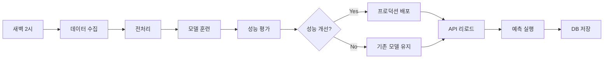
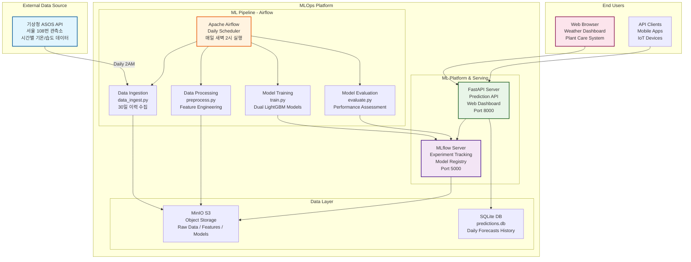

# 🌤️ 서울 날씨 예측 MLOps 시스템

<div align="center">
  
  
  **ASOS 기상관측 데이터 기반 AI 예측으로 스마트한 식물 관리를 지원하는 MLOps 플랫폼**
  
  [](https://python.org)
  [](https://lightgbm.readthedocs.io/)
  [](https://mlflow.org/)
  [](https://fastapi.tiangolo.com/)
  [](https://airflow.apache.org/)
  [](https://docker.com)
</div>

<br>

## 💻 프로젝트 소개

### 🎯 프로젝트 개요 (프로젝트 기간: 약 2주)
- **ASOS 기상관측 API**를 활용한 **기온 & 습도 동시 예측** MLOps 파이프라인 구축
- **Apache Airflow** 기반 완전 자동화된 ML 워크플로우 구현  
- **MLflow**를 통한 실험 관리 및 이중 모델(기온/습도) 버전 관리
- **FastAPI + 반응형 웹 UI**로 실시간 예측 서비스 및 식물 관리 알림 제공
- **Docker Compose** 기반 마이크로서비스 아키텍처로 확장 가능한 MLOps 플랫폼 구현

### 🌱 핵심 가치
> "실시간 기상 데이터 수집부터 AI 예측, 실생활 활용까지의 완전한 MLOps 생태계"

- 🔄 **완전 자동화**: 매일 새벽 2시 데이터 수집 → 모델 훈련 → 성능 평가 → 자동 배포
- 🎯 **실용성**: 단순한 예측을 넘어 식물 관리라는 구체적 활용 사례 제시
- 🏗️ **확장성**: 마이크로서비스 아키텍처로 손쉬운 기능 확장 및 유지보수
- 📊 **투명성**: MLflow 기반 모델 성능 추적 및 A/B 테스팅 지원

<br>

## 👨‍👩‍👦‍👦 팀 구성원

|  |  |  |  |  |  |
| :--------------------------------------------------------------: | :--------------------------------------------------------------: | :--------------------------------------------------------------: | :--------------------------------------------------------------: | :--------------------------------------------------------------: | :--------------------------------------------------------------: |
|            [류지헌](https://github.com/mahomi)             |            [김태현](https://github.com/huefilm)             |            [박성진](https://github.com/psj2024p)             |            [채병기](https://github.com/avatar196kc)             |            [이준석](https://github.com/Lee-0624)             |                        [이상현](https://github.com/yourshlee)                        |
|                            **팀장**(ML엔지니어)                             |                            **ML엔지니어**                             |                            **ML엔지니어**                             |                            **ML엔지니어**                             |                            **ML엔지니어**                             |                       **ML엔지니어**                             |
| 전체 아키텍처 설계<br/>Airflow 파이프라인<br/>Docker 환경 구축 | FastAPI 개발<br/>웹 UI 구현<br/>예측 서비스 API | LightGBM 모델 개발<br/>피처 엔지니어링<br/>모델 성능 테스트| 데이터 수집 & 전처리<br/>ASOS API 연동<br/>S3 스토리지 관리 | MLflow 운영<br/>모델 배포 자동화<br/>DB 관리 | 후반 합류<br/>시스템 테스트<br/>문서화 지원 |

<br>

## 🔨 개발 환경 및 기술 스택

### 🧠 ML/AI 스택
- **머신러닝**: LightGBM 4.3.0 (Gradient Boosting)
- **실험 관리**: MLflow 2.11.0 (모델 레지스트리 & 실험 추적)
- **데이터 처리**: Pandas 2.2.2, NumPy

### ⚙️ MLOps 인프라  
- **워크플로우**: Apache Airflow 2.9.0 (DAG 스케줄링)
- **컨테이너**: Docker Compose (마이크로서비스)
- **객체 스토리지**: MinIO (S3 호환)
- **데이터베이스**: SQLite (예측 결과 저장)

### 🌐 웹 서비스
- **API 프레임워크**: FastAPI 0.111.0
- **웹 서버**: Uvicorn
- **프론트엔드**: Vanilla JS + 모던 CSS (반응형 디자인)

### 🛠️ 개발 도구
- **주 언어**: Python 3.11
- **버전 관리**: Git, GitHub
- **협업 툴**: GitHub Issues, Notion
- **API 연동**: 기상청 ASOS API

<br>

## 📁 프로젝트 구조

```
mlops-weather-prediction/
├── 📁 src/                      # 핵심 MLOps 파이프라인
│   ├── 📄 data_ingest.py        # ASOS 기상관측 데이터 수집 (서울 108번 관측소)
│   ├── 📄 preprocess.py         # 피처 엔지니어링 & 데이터 전처리  
│   ├── 📄 train.py             # LightGBM 이중 모델 훈련 (기온/습도)
│   ├── 📄 evaluate.py          # 모델 성능 평가 & 프로덕션 배포 자동화
│   ├── 📄 predict_api.py       # FastAPI 예측 서비스 + 웹 UI 통합
│   ├── 📄 s3_utils.py          # MinIO S3 스토리지 유틸리티
│   └── 📄 db_utils.py          # SQLite 예측 결과 관리
├── 📁 dags/                     # Airflow 워크플로우
│   └── 📄 weather_forecast_dag.py  # 일일 자동화 DAG 정의 (매일 새벽 2시 실행)
├── 📁 static/                   # 웹 UI 리소스
│   ├── 📄 index.html           # 반응형 예측 대시보드
│   ├── 🖼️ happy_plant.png      # 좋은 날씨 표시 아이콘
│   └── 🖼️ water_please.png     # 물주기 알림 아이콘
├── 📁 data/                     # 데이터 & 분석
│   ├── 📄 eda.ipynb            # 탐색적 데이터 분석
│   └── 📊 *.parquet            # 수집/전처리된 데이터 저장
├── 📁 predictions_data/         # 예측 결과 저장소
│   └── 📄 predictions.db       # SQLite 예측 이력 DB
├── 📄 docker-compose.yaml      # 마이크로서비스 오케스트레이션
├── 📄 Dockerfile              # 애플리케이션 컨테이너 이미지
├── 📄 requirements.txt         # Python 의존성 패키지
└── 📄 README.md               # 프로젝트 문서
```

<br>

## 💻 구현 기능

### 🔍 데이터 수집 & 처리
- **ASOS 기상관측 API**: 서울 지역(108번 관측소) 시간별 기상 데이터 수집
- **지능형 데이터 파이프라인**: 30일 이력 데이터 자동 수집 및 Parquet 저장
- **피처 엔지니어링**: 
  - 시간 기반 파생 변수 (시간, 요일, 사인/코사인 변환)
  - Lag 피처 (1시간, 24시간 전 데이터)
  - Rolling 통계 (3시간, 24시간 이동평균)

### 🤖 머신러닝 모델
- **이중 모델 구조**: 기온 예측 모델 + 습도 예측 모델 독립 운영
- **LightGBM 회귀**: 그래디언트 부스팅 알고리즘으로 24시간 후 예측
- **성능 평가**: RMSE 기반 모델 성능 모니터링 및 자동 배포 결정
- **모델 레지스트리**: MLflow로 seoul_temp, seoul_humid 모델 버전 관리

### 🌐 실시간 웹 서비스
- **FastAPI 기반 REST API**: 
  - `/predict`: 최신 데이터로 예측 수행 및 SQLite DB 저장
  - `/api/latest`: 최근 예측 결과 조회
  - `/reload_model`: 모델 동적 리로딩
  - `/health`: 시스템 상태 체크
- **반응형 웹 대시보드**: 
  - 실시간 예측 결과 시각화
  - 스마트 식물 관리 알림 (기온 30°C 이상 또는 습도 30% 이하)
  - 모바일 최적화 UI/UX

### 🔄 자동화 ML 파이프라인


### 📊 데이터 관리
- **MinIO S3 스토리지**: 수집/전처리 데이터의 버전별 관리
- **SQLite 예측 DB**: 일일 예측 결과 이력 관리 (`predictions.db`)
- **자동 백업**: 실험 데이터 및 모델 아티팩트 자동 백업

<br>

## 🛠️ 시스템 아키텍처



### 🔧 컨테이너 구성
- **minio**: S3 호환 객체 스토리지 (포트: 9000, 9001)
- **mlflow**: 실험 추적 + FastAPI 서비스 통합 (포트: 5000, 8000) 
- **airflow**: 워크플로우 오케스트레이션 (포트: 8080)

<br>

## 🚀 빠른 시작

### 전제 조건
- Docker & Docker Compose 설치
- 기상청 ASOS API 키 발급 ([공공데이터포털](https://www.data.go.kr/))

### 1. 프로젝트 클론
```bash
git clone https://github.com/AIBootcamp13/mlops-cloud-project-mlops_5.git
cd mlops-cloud-project-mlops_5
```

### 2. 환경 변수 설정
```bash
# .env 파일 생성
cat > .env << EOF
KMA_API_KEY=your_weather_api_key_here
MLFLOW_TRACKING_URI=http://localhost:5000
MINIO_ROOT_USER=minio
MINIO_ROOT_PASSWORD=minio123
AWS_ACCESS_KEY_ID=minio
AWS_SECRET_ACCESS_KEY=minio123
EOF
```

### 3. 서비스 시작
```bash
# 전체 MLOps 스택 실행
docker-compose up -d

# 로그 모니터링
docker-compose logs -f
```

### 4. 서비스 접속
- **Airflow UI**: http://localhost:8080 (admin/admin)
- **MLflow UI**: http://localhost:5000 (실험 추적)
- **MinIO Console**: http://localhost:9001 (minio/minio123)
- **FastAPI Docs**: http://localhost:8000/docs (API 문서)
- **웹 대시보드**: http://localhost:8000 (예측 결과 및 식물 관리)

### 5. 첫 예측 실행
```bash
# 수동으로 파이프라인 실행 (테스트용)
docker-compose exec airflow airflow dags trigger weather_daily

# 또는 API로 즉시 예측
curl http://localhost:8000/predict
```

<br>


## 📌 프로젝트 회고

### 🎯 류지헌 (팀장) - MLOps 아키텍트
> *"단순한 예측 모델을 넘어 실제 사용자가 체감할 수 있는 MLOps 플랫폼 구축"*

- **MLOps 파이프라인 설계**: 데이터 수집부터 서빙까지 엔드투엔드 자동화 구현
- **Docker 마이크로서비스**: 각 컴포넌트의 독립적 배포 및 확장 가능한 아키텍처 설계
- **학습 성과**: 프로덕션 환경에서의 ML 시스템 운영 경험과 MLOps 역량 향상

### 🔧 김태현 - 데이터 엔지니어  
> *"사용자 경험을 고려한 ML 서비스 설계의 중요성"*

- **FastAPI 전문 활용**: 비동기 처리 및 자동 API 문서화를 활용한 고성능 서비스 개발
- **반응형 웹 UI**: 반응형 웹 디자인으로 여러 디바이스에서 일관된 UX 제공  
- **학습 성과**: ML 모델과 웹 서비스의 효율적 연동 방법 및 사용자 중심 설계 경험

### 🤖 박성진 - ML 엔지니어
> *"도메인 지식과 피처 엔지니어링이 모델 성능의 핵심"*

- **이중 모델 설계**: 기온과 습도 각각의 특성을 고려한 독립적 모델 아키텍처 설계 실습
- **피처 엔지니어링**: 시간 패턴, Lag 변수, Rolling 통계 등 시계열 특성을 반영한 피처 개발
- **학습 성과**: 실제 데이터의 노이즈와 패턴을 다루는 실무 ML 경험 축적

### 🌐 채병기 - 풀스택 개발자
> *"안정적인 데이터 파이프라인이 좋은 AI 서비스의 기반이 된다"*

- **ASOS API 활용**: 기상청 공공 API의 특성 파악 및 안정적 데이터 수집 파이프라인 구축
- **S3 스토리지 최적화**: MinIO 기반 오브젝트 스토리지로 효율적인 데이터 버전 관리 구현
- **학습 성과**: 대용량 데이터 처리 및 분산 스토리지 활용 역량 확보

### 🔬 이준석 - MLOps 엔지니어
> *"모델 생명주기 관리와 지속적인 성능 모니터링의 가치"*

- **MLflow 운영**: 실험 추적, 모델 레지스트리, 자동 배포까지 완전한 ML 생명주기 관리
- **성능 기반 배포**: 이전 모델 대비 성능 개선 시에만 자동 배포되는 지능형 시스템 구축
- **학습 성과**: ML 모델의 지속적 개선과 운영 자동화 프로세스 구축 경험

### 🔄 이상현 - ML 엔지니어
> *"팀 중반 합류했지만 체계적인 아키텍처 덕분에 빠른 적응 가능"*

- **빠른 적응**: 타 팀에서 뒤늦게 합류했지만 잘 구조화된 MLOps 파이프라인 덕분에 신속한 온보딩
- **시스템 테스트**: 전체 파이프라인의 안정성 검증 및 엣지 케이스 테스트 수행
- **문서화 지원**: 프로젝트 문서 정리 및 사용자 가이드 작성으로 팀 기여
- **학습 성과**: 완성도 높은 MLOps 시스템 구조 학습 및 협업 프로세스 이해

### 🏆 팀 전체 성과
- **기술적 도전**: 7개 오픈소스 기술 스택의 효율적 통합 및 상호 연동 
- **실용성 검증**: 실제 서비스 가능한 수준의 MLOps 플랫폼 구축 완료
- **확장성 설계**: 마이크로서비스 아키텍처로 향후 기능 확장 기반 마련
- **협업 문화**: 코드 리뷰, 이슈 트래킹을 통한 체계적 팀 개발 프로세스 구축

<br>

## 📚 참고자료

### 📖 공식 문서
- [🌤️ 기상청 ASOS API 가이드](https://www.data.go.kr/data/15057210/openapi.do) - 기상관측 데이터 활용법
- [🐝 Apache Airflow 공식 문서](https://airflow.apache.org/docs/) - 워크플로우 오케스트레이션  
- [🔬 MLflow 공식 문서](https://mlflow.org/docs/latest/index.html) - ML 생명주기 관리
- [⚡ FastAPI 공식 문서](https://fastapi.tiangolo.com/) - 모던 웹 API 프레임워크
- [🌳 LightGBM 공식 문서](https://lightgbm.readthedocs.io/) - 그래디언트 부스팅
- [🐳 Docker Compose 가이드](https://docs.docker.com/compose/) - 컨테이너 오케스트레이션

### 🛠️ 기술 리소스
- [MLOps 베스트 프랙티스](https://ml-ops.org/) - MLOps 방법론 및 도구
- [시계열 예측 모델링](https://otexts.com/fpp3/) - 시계열 분석 이론과 실습

<br>

---

<div align="center">
  
### 🌟 이 프로젝트가 도움이 되셨다면 ⭐를 눌러주세요!

**Built with ❤️ by [AIBootcamp13 Team](https://github.com/AIBootcamp13) (10 Days Sprint)**

[](https://deepwiki.com/AIBootcamp13/mlops-cloud-project-mlops_5)

</div>
