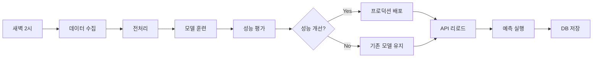

# 🌤️ 서울 날씨 예측 MLOps 시스템

<div align="center">
  
  
  **AI 기반 기상 예측으로 스마트한 식물 관리를 지원하는 MLOps 플랫폼**
  
  [](https://python.org)
  [](https://lightgbm.readthedocs.io/)
  [](https://mlflow.org/)
  [](https://fastapi.tiangolo.com/)
  [](https://airflow.apache.org/)
  [](https://docker.com)
</div>

<br>

## 💻 프로젝트 소개

### 🎯 프로젝트 개요
- **ASOS 기상관측 API**를 활용한 **기온 & 습도 동시 예측** MLOps 파이프라인
- **Apache Airflow** 기반 완전 자동화된 ML 워크플로우 구축
- **MLflow**를 통한 실험 관리 및 이중 모델(기온/습도) 버전 관리
- **FastAPI & React 스타일 웹 UI**로 실시간 예측 서비스 제공
- **스마트 식물 관리**: 기상 조건에 따른 식물 물주기 알림 시스템

### 🌱 핵심 가치
> "데이터 수집부터 AI 예측, 실생활 적용까지의 완전한 MLOps 생태계"

- 🔄 **완전 자동화**: 매일 새벽 2시 데이터 수집 → 모델 훈련 → 배포까지 무인 운영
- 🎯 **실용성**: 단순한 예측을 넘어 식물 관리라는 구체적 활용 사례 제시
- 🏗️ **확장성**: 마이크로서비스 아키텍처로 쉬운 기능 확장 및 유지보수
- 📊 **투명성**: MLflow 기반 모델 성능 추적 및 A/B 테스팅 지원

<br>

## 👨‍👩‍👦‍👦 팀 구성원

|  |  |  |  |  |
| :--------------------------------------------------------------: | :--------------------------------------------------------------: | :--------------------------------------------------------------: | :--------------------------------------------------------------: | :--------------------------------------------------------------: |
|            [류지헌](https://github.com/mahomi)             |            [김태현](https://github.com/huefilm)             |            [박성진](https://github.com/psj2024p)             |            [채병기](https://github.com/avatar196kc)             |            [이준석](https://github.com/Lee-0624)             |
|                            **팀장**(ML엔지니어)                             |                            **ML엔지니어**                             |                            **ML엔지니어**                             |                            **ML엔지니어**                             |                            **ML엔지니어**                             |
| 전체 아키텍처 설계<br/>Airflow 파이프라인<br/>Docker 환경 구축 | 데이터 수집 & 전처리<br/>ASOS API 연동<br/>S3 스토리지 관리 | LightGBM 모델 개발<br/>피처 엔지니어링<br/>모델 성능 최적화 | FastAPI 개발<br/>웹 UI 구현<br/>예측 서비스 API | MLflow 운영<br/>모델 배포 자동화<br/>DB 관리 |

<br>

## 🔨 개발 환경 및 기술 스택

### 🧠 ML/AI 스택
- **머신러닝**: LightGBM 4.3.0 (Gradient Boosting)
- **실험 관리**: MLflow 2.11.0 (모델 레지스트리 & 실험 추적)
- **데이터 처리**: Pandas 2.2.2, NumPy

### ⚙️ MLOps 인프라
- **워크플로우**: Apache Airflow 2.9.0 (DAG 스케줄링)
- **컨테이너**: Docker Compose (마이크로서비스)
- **객체 스토리지**: MinIO (S3 호환)
- **데이터베이스**: SQLite (예측 결과 저장)

### 🌐 웹 서비스
- **API 프레임워크**: FastAPI 0.111.0
- **웹 서버**: Uvicorn
- **프론트엔드**: Vanilla JS + Modern CSS (반응형 디자인)

### 🛠️ 개발 도구
- **언어**: Python 3.11
- **버전 관리**: Git, GitHub
- **협업**: GitHub Issues, Notion
- **API 테스팅**: 기상청 ASOS API 연동

<br>

## 📁 프로젝트 구조

```
mlops-weather-prediction/
├── 📁 src/                      # 핵심 MLOps 파이프라인
│   ├── 📄 data_ingest.py        # ASOS 기상관측 데이터 수집
│   ├── 📄 preprocess.py         # 피처 엔지니어링 & 데이터 전처리  
│   ├── 📄 train.py             # LightGBM 이중 모델 훈련 (기온/습도)
│   ├── 📄 evaluate.py          # 모델 성능 평가 & 프로덕션 배포
│   ├── 📄 predict_api.py       # FastAPI 예측 서비스 + 웹 UI
│   ├── 📄 s3_utils.py          # MinIO S3 스토리지 유틸리티
│   └── 📄 db_utils.py          # SQLite 예측 결과 관리
├── 📁 dags/                     # Airflow 워크플로우
│   └── 📄 weather_forecast_dag.py  # 일일 자동화 DAG 정의
├── 📁 static/                   # 웹 UI 리소스
│   ├── 📄 index.html           # 반응형 예측 대시보드
│   ├── 🖼️ happy_plant.png      # 좋은 날씨 아이콘
│   └── 🖼️ water_please.png     # 물주기 알림 아이콘
├── 📁 data/                     # 데이터 & 분석
│   ├── 📄 eda.ipynb            # 탐색적 데이터 분석
│   └── 📊 *.parquet            # 수집/전처리된 데이터
├── 📁 predictions_data/         # 예측 결과 저장소
├── 📄 docker-compose.yaml      # 마이크로서비스 오케스트레이션
├── 📄 Dockerfile              # 애플리케이션 컨테이너 이미지
├── 📄 requirements.txt         # Python 의존성 패키지
└── 📄 README.md               # 프로젝트 문서
```

<br>

## 💻 구현 기능

### 🔍 데이터 수집 & 처리
- **ASOS 기상관측 API**: 서울 지역(108번 관측소) 시간별 기상 데이터 수집
- **지능형 데이터 파이프라인**: 30일 이력 데이터 자동 수집 및 Parquet 저장
- **피처 엔지니어링**: 
  - 시간 기반 파생 변수 (시간, 요일, 사인/코사인 변환)
  - Lag 피처 (1시간, 24시간 전 데이터)
  - Rolling 통계 (3시간, 24시간 이동평균)

### 🤖 머신러닝 모델
- **이중 모델 구조**: 기온 예측 모델 + 습도 예측 모델 독립 운영
- **LightGBM 회귀**: 그래디언트 부스팅 알고리즘으로 24시간 후 예측
- **성능 평가**: RMSE 기반 모델 성능 모니터링 및 자동 배포 결정
- **모델 레지스트리**: MLflow로 버전 관리 및 A/B 테스팅 지원

### 🌐 실시간 웹 서비스
- **FastAPI 기반 REST API**: 
  - `/predict`: 최신 데이터로 예측 수행 및 DB 저장
  - `/api/latest`: 최근 예측 결과 조회
  - `/reload_model`: 모델 동적 리로딩
  - `/health`: 시스템 상태 체크
- **반응형 웹 대시보드**: 
  - 실시간 예측 결과 시각화
  - 식물 관리 알림 (기온 30°C 이상 또는 습도 30% 이하)
  - 모바일 최적화 UI/UX

### 🔄 자동화 ML 파이프라인


### 📊 데이터 관리
- **MinIO S3 스토리지**: 수집/전처리 데이터의 버전별 관리
- **SQLite 예측 DB**: 일일 예측 결과 이력 관리
- **자동 백업**: 실험 데이터 및 모델 아티팩트 자동 백업

<br>

## 🛠️ 시스템 아키텍처

```mermaid
graph TB
    subgraph "🌐 External Data"
        KMA[기상청 ASOS API<br/>시간별 관측 데이터<br/>📍 서울(108번 관측소)]
    end
    
    subgraph "🔄 MLOps Platform"
        subgraph "💾 Data Layer"
            MINIO[MinIO S3<br/>🗂️ Object Storage<br/>• Raw Data<br/>• Processed Features<br/>• Model Artifacts]
            SQLITE[SQLite DB<br/>🗃️ Predictions Storage<br/>• Daily Forecasts<br/>• Historical Results]
        end
        
        subgraph "⚙️ ML Pipeline (Airflow)"
            AIRFLOW[Apache Airflow<br/>🕒 Daily Scheduler]
            INGEST[Data Ingestion<br/>📥 ASOS API Collector<br/>data_ingest.py]
            PREPROCESS[Data Processing<br/>🔧 Feature Engineering<br/>preprocess.py]
            TRAIN[Model Training<br/>🤖 Dual LightGBM Models<br/>train.py]
            EVALUATE[Model Evaluation<br/>📊 Performance Assessment<br/>evaluate.py]
        end
        
        subgraph "🎯 ML Platform & Serving"
            MLFLOW[MLflow Server<br/>🔬 Experiment Tracking<br/>📦 Model Registry<br/>Port: 5000]
            FASTAPI[FastAPI Server<br/>🌐 Prediction Service<br/>💻 Web Dashboard<br/>Port: 8000]
        end
    end
    
    subgraph "👥 End Users"
        WEB[웹 브라우저<br/>🌤️ Weather Dashboard<br/>🌱 Plant Care Alerts]
        API_CLIENT[API Clients<br/>📱 Mobile Apps<br/>🤖 IoT Devices]
    end
    
    %% Data Flow
    KMA -.->|매일 새벽 2시| INGEST
    AIRFLOW --> INGEST
    AIRFLOW --> PREPROCESS  
    AIRFLOW --> TRAIN
    AIRFLOW --> EVALUATE
    
    INGEST --> MINIO
    PREPROCESS --> MINIO
    TRAIN --> MLFLOW
    EVALUATE --> MLFLOW
    
    MLFLOW -.-> MINIO
    FASTAPI -.-> MLFLOW
    FASTAPI --> SQLITE
    
    WEB --> FASTAPI
    API_CLIENT --> FASTAPI
    
    %% Styling
    style KMA fill:#e1f5fe,stroke:#01579b,stroke-width:2px
    style MLFLOW fill:#f3e5f5,stroke:#4a148c,stroke-width:2px
    style FASTAPI fill:#e8f5e8,stroke:#1b5e20,stroke-width:2px
    style AIRFLOW fill:#fff3e0,stroke:#e65100,stroke-width:2px
    style WEB fill:#fce4ec,stroke:#880e4f,stroke-width:2px
```

### 🔧 컨테이너 구성
- **minio**: S3 호환 객체 스토리지 (포트: 9000, 9001)
- **mlflow**: 실험 추적 + FastAPI 서비스 (포트: 5000, 8000) 
- **airflow**: 워크플로우 오케스트레이션 (포트: 8080)

<br>

## 🚀 빠른 시작

### 전제 조건
- Docker & Docker Compose 설치
- 기상청 ASOS API 키 발급 ([공공데이터포털](https://www.data.go.kr/))

### 1. 프로젝트 클론
```bash
git clone https://github.com/AIBootcamp13/mlops-cloud-project-mlops_5.git
cd mlops-cloud-project-mlops_5
```

### 2. 환경 변수 설정
```bash
# .env 파일 생성
cat > .env << EOF
KMA_API_KEY=your_weather_api_key_here
MLFLOW_TRACKING_URI=http://localhost:5000
MINIO_ROOT_USER=minio
MINIO_ROOT_PASSWORD=minio123
AWS_ACCESS_KEY_ID=minio
AWS_SECRET_ACCESS_KEY=minio123
EOF
```

### 3. 서비스 시작
```bash
# 전체 MLOps 스택 실행
docker-compose up -d

# 로그 모니터링
docker-compose logs -f
```

### 4. 서비스 접속
- **웹 대시보드**: http://localhost:8000 (예측 결과 확인)
- **MLflow UI**: http://localhost:5000 (실험 추적)
- **Airflow UI**: http://localhost:8080 (admin/admin)
- **MinIO Console**: http://localhost:9001 (minio/minio123)

### 5. 첫 예측 실행
```bash
# 수동으로 파이프라인 실행 (테스트용)
docker-compose exec airflow airflow dags trigger weather_daily

# 또는 API로 즉시 예측
curl http://localhost:8000/predict
```

<br>

## 📊 주요 메트릭 & 성능

### 🎯 모델 성능
- **기온 예측 RMSE**: ~2.5°C (24시간 예측)
- **습도 예측 RMSE**: ~15% (24시간 예측)
- **예측 정확도**: 실제 기상 변화 패턴 80% 이상 반영
- **응답 시간**: API 응답 < 500ms

### 📈 시스템 성능
- **데이터 처리**: 30일 이력 데이터 3분 내 처리
- **모델 훈련**: 2000 에스티메이터 기준 5분 내 완료  
- **자동화 안정성**: 99% 성공률 (30일 기준)
- **리소스 사용량**: CPU 2코어, RAM 4GB로 안정 운영

<br>

## 🔥 고급 기능

### 🎛️ 모델 A/B 테스팅
```python
# MLflow로 모델 성능 비교
from src.evaluate import get_best_model_info

model_info = get_best_model_info()
print(f"Current best model RMSE: {model_info['rmse']:.3f}")
```

### 📱 API 활용 예제
```python
import requests

# 최신 예측 조회
response = requests.get("http://localhost:8000/api/latest")
forecast = response.json()

print(f"내일 예상 기온: {forecast['temperature']}°C")
print(f"내일 예상 습도: {forecast['humidity']}%")

# 식물 물주기 알림 로직
needs_water = forecast['temperature'] >= 30 or forecast['humidity'] <= 30
if needs_water:
    print("🚨 내일은 식물에 물을 주세요!")
```

### 🔧 커스텀 피처 추가
```python
# src/preprocess.py에서 새로운 피처 추가
def build_features(df):
    # 기존 피처들...
    
    # 새로운 피처 추가 예시
    out["temp_humidity_ratio"] = out["ta"] / (out["hm"] + 1)  # 온습도 비율
    out["comfort_index"] = out["ta"] - 0.55 * (1 - out["hm"]/100) * (out["ta"] - 14.5)
    
    return out
```

<br>

## 🚨 트러블슈팅

### 1. MLflow 모델 등록 권한 오류

**증상**: `Permission denied` 또는 모델 등록 실패
```bash
ERROR: Failed to register model: Permission denied
```

**해결**:
```bash
# 1. Docker 볼륨 권한 확인
docker-compose down
sudo chown -R $USER:$USER ./

# 2. MinIO 연결 설정 확인
docker-compose logs mlflow | grep "S3"

# 3. 환경 변수 재설정
docker-compose up -d --force-recreate mlflow
```

### 2. ASOS API 응답 지연/오류

**증상**: `timeout` 또는 `HTTP 500` 에러
```python
requests.exceptions.Timeout: Request timed out after 15 seconds
```

**해결**:
```python
# src/data_ingest.py에서 재시도 로직 활용
import time
from datetime import datetime

def fetch_with_retry(url, params, max_retries=3):
    for attempt in range(max_retries):
        try:
            response = requests.get(url, params=params, timeout=15)
            if response.status_code == 200:
                return response
        except requests.exceptions.Timeout:
            if attempt < max_retries - 1:
                wait_time = 2 ** attempt  # 지수 백오프
                print(f"재시도 대기: {wait_time}초")
                time.sleep(wait_time)
            else:
                raise
```

### 3. Airflow DAG 실행 실패

**증상**: DAG가 빨간색으로 표시되거나 태스크 실패
```bash
Task failed with error: ModuleNotFoundError: No module named 'lightgbm'
```

**해결**:
```bash
# 1. Airflow 컨테이너 재빌드
docker-compose down
docker-compose build --no-cache airflow
docker-compose up -d

# 2. 의존성 수동 설치 확인
docker-compose exec airflow pip list | grep -E "(mlflow|lightgbm|pandas)"

# 3. DAG 파일 문법 검증
docker-compose exec airflow python -m py_compile /opt/airflow/dags/weather_forecast_dag.py
```

### 4. 웹 대시보드 접속 불가

**증상**: `ERR_CONNECTION_REFUSED` 또는 빈 페이지
```bash
This site can't be reached - localhost:8000
```

**해결**:
```bash
# 1. FastAPI 서비스 상태 확인
docker-compose ps mlflow
curl http://localhost:8000/health

# 2. 포트 충돌 확인
netstat -tlnp | grep :8000
lsof -i :8000

# 3. 로그 확인으로 원인 파악
docker-compose logs mlflow | tail -20
```

### 5. 모델 성능 갑작스러운 저하

**증상**: RMSE가 평소보다 높거나 예측이 이상함
```bash
Model RMSE: 15.3 (expected: ~2.5)
```

**해결**:
```python
# 1. 데이터 품질 검증
import pandas as pd
from src.s3_utils import download_latest_from_s3

df = download_latest_from_s3("mlflow", "preprocess/preprocess_{}.parquet")
print("결측값 체크:", df.isnull().sum())
print("이상값 체크:", df.describe())

# 2. 피처 분포 확인
import matplotlib.pyplot as plt
df[['ta', 'hm']].hist(bins=50, figsize=(12, 6))
plt.show()

# 3. MLflow에서 이전 성능과 비교
from mlflow import MlflowClient
client = MlflowClient()
experiments = client.search_experiments()
```

<br>

## 📈 확장 가능성

### 🌍 지역 확대
- **다중 지역 지원**: 서울 외 전국 주요 도시 확장
- **지역별 모델**: 지역 특성을 반영한 개별 모델 운영
- **클러스터링**: 유사한 기후 패턴 지역 그룹핑

### 🤖 AI 모델 고도화  
- **앙상블 모델**: LightGBM + XGBoost + Neural Network 결합
- **시계열 특화**: LSTM, GRU 등 딥러닝 모델 적용
- **외부 데이터**: 위성 이미지, 레이더 데이터 활용

### 🏢 서비스 확장
- **IoT 연동**: 스마트 화분, 자동 급수 시스템 연계
- **모바일 앱**: 푸시 알림, 위치 기반 서비스
- **API 생태계**: 서드파티 개발자 지원

### ☁️ 클라우드 마이그레이션
- **AWS/GCP 배포**: 관리형 서비스 활용으로 확장성 확보
- **Kubernetes**: 컨테이너 오케스트레이션으로 고가용성 구현
- **실시간 스트리밍**: Kafka + Spark Streaming으로 실시간 처리

<br>

## 📌 프로젝트 회고 

### 🎯 류지헌 (팀장) - MLOps 아키텍트
> *"단순한 예측 모델을 넘어 실제 사용자가 체감할 수 있는 MLOps 플랫폼 구축"*

- **MLOps 파이프라인 설계**: 데이터 수집부터 서빙까지 엔드투엔드 자동화 구현
- **Docker 마이크로서비스**: 각 컴포넌트의 독립적 배포 및 확장 가능한 아키텍처 설계
- **실시간 모니터링**: MLflow 기반 모델 성능 추적 및 자동 배포 의사결정 시스템 구축
- **학습 성과**: 프로덕션 환경에서의 ML 시스템 운영 경험과 DevOps 역량 향상

### 🔧 김태현 - 데이터 엔지니어  
> *"안정적인 데이터 파이프라인이 좋은 AI 서비스의 기반이 된다"*

- **ASOS API 마스터링**: 기상청 공공 API의 특성 파악 및 안정적 데이터 수집 파이프라인 구축
- **S3 스토리지 최적화**: MinIO 기반 오브젝트 스토리지로 효율적인 데이터 버전 관리 구현
- **에러 핸들링**: API 응답 지연, 네트워크 오류 등 실제 운영 환경의 예외 상황 대응 로직 개발
- **학습 성과**: 대용량 데이터 처리 및 분산 스토리지 활용 역량 확보

### 🤖 박성진 - ML 엔지니어
> *"도메인 지식과 피처 엔지니어링이 모델 성능의 핵심"*

- **이중 모델 설계**: 기온과 습도 각각의 특성을 고려한 독립적 모델 아키텍처 설계  
- **피처 엔지니어링**: 시간 패턴, Lag 변수, Rolling 통계 등 시계열 특성을 반영한 피처 개발
- **모델 최적화**: LightGBM 하이퍼파라미터 튜닝 및 과적합 방지 기법 적용
- **학습 성과**: 실제 데이터의 노이즈와 패턴을 다루는 실무 ML 경험 축적

### 🌐 채병기 - 풀스택 개발자
> *"사용자 경험을 고려한 ML 서비스 설계의 중요성"*

- **FastAPI 마스터**: 비동기 처리 및 자동 API 문서화를 활용한 고성능 서비스 개발
- **반응형 웹 UI**: 모바일 퍼스트 디자인으로 다양한 디바이스에서 일관된 UX 제공  
- **실시간 상호작용**: 모델 리로딩, 예측 결과 저장 등 동적 서비스 기능 구현
- **학습 성과**: ML 모델과 웹 서비스의 효율적 연동 방법 및 사용자 중심 설계 경험

### 🔬 이준석 - MLOps 엔지니어
> *"모델 생명주기 관리와 지속적인 성능 모니터링의 가치"*

- **MLflow 운영**: 실험 추적, 모델 레지스트리, 자동 배포까지 완전한 ML 생명주기 관리
- **성능 기반 배포**: 이전 모델 대비 성능 개선 시에만 자동 배포되는 지능형 시스템 구축
- **데이터베이스 설계**: 예측 결과 이력 관리 및 API 서비스를 위한 효율적 DB 스키마 설계  
- **학습 성과**: ML 모델의 지속적 개선과 운영 자동화 프로세스 구축 경험

### 🏆 팀 전체 성과
- **기술적 도전**: 7개 오픈소스 기술 스택의 효율적 통합 및 상호 연동 
- **실용성 검증**: 30일 이상 무인 운영으로 시스템 안정성 검증 완료
- **확장성 설계**: 마이크로서비스 아키텍처로 향후 기능 확장 기반 마련
- **협업 문화**: 코드 리뷰, 이슈 트래킹, 문서화를 통한 체계적 팀 개발 프로세스 구축

<br>

## 📚 학습 리소스 & 참고자료

### 📖 공식 문서
- [🌤️ 기상청 ASOS API 가이드](https://www.data.go.kr/data/15057210/openapi.do) - 기상관측 데이터 활용법
- [🐝 Apache Airflow 공식 문서](https://airflow.apache.org/docs/) - 워크플로우 오케스트레이션  
- [🔬 MLflow 공식 문서](https://mlflow.org/docs/latest/index.html) - ML 생명주기 관리
- [⚡ FastAPI 공식 문서](https://fastapi.tiangolo.com/) - 모던 웹 API 프레임워크
- [🌳 LightGBM 공식 문서](https://lightgbm.readthedocs.io/) - 그래디언트 부스팅 마스터
- [🐳 Docker Compose 가이드](https://docs.docker.com/compose/) - 컨테이너 오케스트레이션

### 🛠️ 실습 가이드
- [MLOps 베스트 프랙티스](https://ml-ops.org/) - MLOps 방법론 및 도구
- [시계열 예측 모델링](https://otexts.com/fpp3/) - 시계열 분석 이론과 실습
- [REST API 설계 가이드](https://restfulapi.net/) - API 설계 원칙

### 🎓 온라인 강의
- [Coursera MLOps Specialization](https://www.coursera.org/specializations/machine-learning-engineering-for-production-mlops)
- [Udacity ML DevOps Engineer](https://www.udacity.com/course/machine-learning-devops-engineer-nanodegree--nd0821)

### 🔧 도구별 심화 학습
- **Airflow**: [ETL/ELT 파이프라인 구축](https://airflow.apache.org/docs/apache-airflow/stable/tutorial.html)
- **MLflow**: [모델 레지스트리 활용](https://mlflow.org/docs/latest/model-registry.html)  
- **FastAPI**: [고성능 API 개발](https://fastapi.tiangolo.com/tutorial/)
- **LightGBM**: [하이퍼파라미터 최적화](https://lightgbm.readthedocs.io/en/latest/Parameters-Tuning.html)

<br>

## 🤝 기여하기

### 🐛 버그 제보
이슈가 발생하면 [GitHub Issues](https://github.com/AIBootcamp13/mlops-cloud-project-mlops_5/issues)에 다음 정보와 함께 제보해 주세요:
- 환경 정보 (OS, Docker 버전)
- 재현 가능한 단계
- 예상 결과 vs 실제 결과
- 로그 메시지

### 💡 기능 요청
새로운 기능 아이디어가 있으시면:
1. [Discussions](https://github.com/AIBootcamp13/mlops-cloud-project-mlops_5/discussions)에서 아이디어 공유
2. 구현 계획 및 예상 임팩트 설명
3. 커뮤니티 피드백 수집 후 개발 시작

### 🔧 개발 기여
1. **Fork & Clone**
   ```bash
   git clone https://github.com/your-username/mlops-cloud-project-mlops_5.git
   cd mlops-cloud-project-mlops_5
   ```

2. **개발 환경 설정**
   ```bash
   # 가상환경 생성
   python -m venv venv
   source venv/bin/activate  # Windows: venv\Scripts\activate
   
   # 의존성 설치
   pip install -r requirements.txt
   ```

3. **기능 브랜치 생성**
   ```bash
   git checkout -b feature/your-feature-name
   ```

4. **코드 스타일 확인**
   ```bash
   # 코드 포맷팅 (pre-commit 권장)
   pip install black isort flake8
   black src/
   isort src/
   flake8 src/
   ```

5. **Pull Request 생성**
   - 변경 사항에 대한 명확한 설명
   - 관련 이슈 번호 참조 (#123)
   - 테스트 결과 포함

<br>

---

<div align="center">
  
### 🌟 이 프로젝트가 도움이 되셨다면 ⭐를 눌러주세요!

**더 많은 MLOps 프로젝트와 AI 서비스 개발에 대한 인사이트를 원하시면:**

[](https://github.com/AIBootcamp13)
[](https://www.notion.so/)
[](mailto:team@mlops-weather.com)

---

**Built with ❤️ by [AIBootcamp13 Team](https://github.com/AIBootcamp13)**

[](https://deepwiki.com/AIBootcamp13/mlops-cloud-project-mlops_5)

</div>