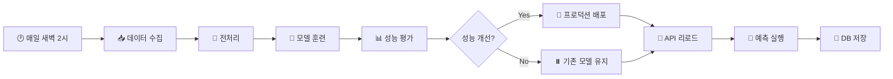
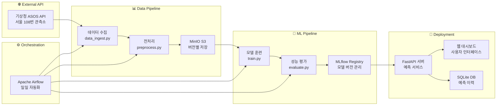
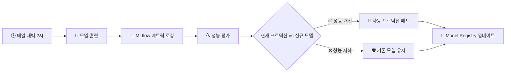

## Slide 4. 팀 소개
- 팀명/다짐 : [FromScratch] 두려움 없이 처음부터 새롭게 시작 🚀
- 팀 멤버

| 멤버 | 전공/관심분야 | 담당 역할 |
|------|---------------|-----------|
| **🎯 류지헌 (팀장)** | ML 엔지니어 | • 전체 아키텍처 설계<br/>• Airflow 파이프라인 구축<br/>• Docker 환경 구축 |
| **🔧 김태현** | 광고, 농업 / 광고, 농학 | • FastAPI 개발<br/>• 웹 UI 구현<br/>• 예측 서비스 API |
| **🤖 박성진** | ML 엔지니어 | • LightGBM 모델 개발<br/>• 피처 엔지니어링<br/>• 모델 성능 테스트 |
| **🌐 채병기** | 메이커, 교육, 로봇 / 전자공학 | • 데이터 수집 & 전처리<br/>• ASOS API 연동<br/>• S3 스토리지 관리 |
| **🔬 이준석** | ML 엔지니어 | • MLflow 운영<br/>• 모델 배포 자동화<br/>• DB 관리 |
| **🔄 이상현** | ML 엔지니어 | • 후반 합류<br/>• 시스템 테스트<br/>• 문서화 지원 |


## Slide 5. 프로젝트 협업 방식
### MLOps Project

#### 📋 협업 방식
- **개발 기간**: 약 2주 (2025.05.26 ~ 2025.06.10) 진행
- **협업 도구**: GitHub Issues, Notion를 통한 일일 스탠드업
- **코드 관리**: GitHub 중심의 버전 관리 및 Pull Request 리뷰 실습

#### 🤝 문제 해결 과정
- **문제 상황**: Docker Compose 환경에서 서비스 간 네트워킹 이슈 발생
- **해결 방법**: 
  - 팀원들과 실시간 디버깅 세션 진행
  - 환경 변수 설정 및 포트 매핑 최적화
  - Airflow와 MLflow 간 통신 문제 해결

#### 💡 협업의 성과
- **기술 스택 통합**: Airflow, MLflow, MinIO, FastAPI 효율적 연동 성공
- **역할 분담**: 각자의 전문성을 살린 명확한 책임 분배
- **지식 공유**: 어려운 부분은 즉시 공유하여 팀 전체 역량 향상


## Slide 7. 프로젝트 목표 수립
### MLOps Project | 목표 및 주요 작업

#### 🎯 주제
* MLOps 프로젝트 | 데이터 전처리부터 모델 서빙까지의 경험
* 기상관측 데이터 기반 AI 예측으로 스마트한 식물 관리를 MLOps 프로젝트로 구현

#### 🎯 목표
* **핵심 목표**
  * 🏗️ MLOps 아키텍처 설계
  * 🔄 완전 자동화된 ML 파이프라인 구축 (데이터 수집 → 훈련 → 배포)
  * 🎯 실용적인 AI 서비스 구현 (식물 관리 알림 기능)

* **주요 작업**
  * 🌐 기상관측 데이터 API 연동 및 실시간 데이터 수집
  * 🤖 LightGBM 기반 이중 모델 (기온/습도) 개발
  * ⚙️ Apache Airflow 기반 일일 자동화 파이프라인
  * 📊 MLflow를 통한 실험 관리 및 모델 버전 관리
  * 🌐 FastAPI + 반응형 웹 UI로 사용자 서비스 제공

#### 📝 개요
* **배경**
  * 가정과 농장에서 활용가능한 식물 관리 서비스 구현 (스마트팜 활용. 물주기, 온도 조절 등)
  * 기상관측 데이터를 활용한 MLOps 프로젝트 구현
* **기간**
  * 2025.05.26 ~ 2025.06.10 (약 2주간 집중 개발)


## Slide 8. 프로젝트 개요
### MLOps Project | 기술 스택 및 아키텍처

#### 🧠 ML/AI 스택
| 구분 | 기술 | 버전 | 역할 |
|------|------|------|------|
| 머신러닝 | LightGBM | 4.3.0 | 그래디언트 부스팅 회귀 모델 |
| 실험 관리 | MLflow | 2.11.0 | 모델 레지스트리 & 실험 추적 |
| 데이터 처리 | Pandas, NumPy | 2.2.2+ | 데이터 전처리 및 피처 엔지니어링 |

#### ⚙️ MLOps 인프라
| 구분 | 기술 | 버전 | 역할 |
|------|------|------|------|
| 워크플로우 | Apache Airflow | 2.9.0 | DAG 스케줄링 (매일 새벽 2시) |
| 컨테이너 | Docker Compose | - | 마이크로서비스 오케스트레이션 |
| 스토리지 | MinIO | - | S3 호환 객체 스토리지 |
| 데이터베이스 | SQLite | - | 예측 결과 이력 관리 |

#### 🌐 웹 서비스
| 구분 | 기술 | 버전 | 역할 |
|------|------|------|------|
| API | FastAPI | 0.111.0 | REST API 서버 |
| 웹서버 | Uvicorn | - | ASGI 웹서버 |
| 프론트엔드 | Vanilla JS + CSS | - | 반응형 웹 대시보드 |


## Slide 9. 프로젝트 개요
### MLOps Project | 데이터 전처리

#### 📊 데이터 수집 및 처리 과정



#### 🛠️ 주요 전처리 과정
* **데이터 수집**: 서울 지역(108번 관측소) 시간별 기온/습도 데이터
* **결측치 처리**: 선형 보간법 및 이상치 제거
* **피처 엔지니어링**:
  - ⏰ **시간 기반 파생 변수**: 시간, 요일, 사인/코사인 변환
  - 📈 **Lag 피처**: 1시간, 24시간 전 데이터
  - 📊 **Rolling 통계**: 3시간, 24시간 이동평균
* **데이터 저장**: MinIO S3에 Parquet 형태로 버전별 관리


## Slide 11. 프로젝트 수행 절차 및 방법
### MLOps Project | 데이터셋 및 데이터 처리

#### STEP 01. 📊 데이터셋
- **데이터셋 이름**: 
  - 🌐 ASOS 기상관측 데이터 (서울 108번 관측소)
- **출처**
  - 🏛️ 기상청 종관기상관측 (ASOS) 공공 API
  http://apis.data.go.kr/1360000/AsosHourlyInfoService/getWthrDataList
- **목표**
  - 📈 시간별 기상 데이터를 기반으로 24시간 후 기온 및 습도 예측

#### STEP 02. 📏 평가 지표
- **🎯 RMSE (Root Mean Square Error)** : 회귀 모델의 예측 정확도 평가
- **⚡ 배포 기준**: 이전 모델 대비 RMSE 개선 시 자동 배포

#### STEP 03. 📋 데이터 특징
- **🌡️ 시계열 데이터** : 시간별 연속 관측 데이터로 시간 패턴 중요
- **🔢 수치형 변수** : 기온(°C), 습도(%), 기압(hPa) 등 연속형 데이터
- **🕐 시간 의존성** : 이전 시점 데이터가 현재 예측에 큰 영향
- **🌦️ 계절성** : 일간/주간/계절별 패턴 존재

#### STEP 04. 📝 주요 컬럼
- **tm** : 관측 시간 (YYYY-MM-DD HH:MM)
- **ta** : 기온 (°C) - 주 예측 타겟
- **hm** : 습도 (%) - 주 예측 타겟  
- **ps** : 현지기압 (hPa) - 피처 변수
- **ws** : 풍속 (m/s) - 피처 변수
- **wd** : 풍향 (16방위) - 범주형 피처


## Slide 12. 프로젝트 수행 절차 및 방법
### MLOps Project | 데이터 전처리

#### 🔧 피처 엔지니어링 상세

```python
# 시간 기반 파생 변수 생성
df['hour'] = df['tm'].dt.hour
df['day_of_week'] = df['tm'].dt.dayofweek
df['hour_sin'] = np.sin(2 * np.pi * df['hour'] / 24)
df['hour_cos'] = np.cos(2 * np.pi * df['hour'] / 24)

# Lag 피처 생성 (과거 데이터 활용)
df['ta_lag_1h'] = df['ta'].shift(1)    # 1시간 전 기온
df['hm_lag_1h'] = df['hm'].shift(1)    # 1시간 전 습도
df['ta_lag_24h'] = df['ta'].shift(24)  # 24시간 전 기온

# Rolling 통계 (이동평균/표준편차)
df['ta_rolling_3h'] = df['ta'].rolling(3).mean()
df['hm_rolling_24h'] = df['hm'].rolling(24).mean()
```

#### 📊 전처리 후 데이터 예시

| tm | ta | hm | ta_lag_1h | ta_rolling_3h | hour_sin | target_ta_24h |
|----|----|----|-----------|-----------    |----------|---------------|
| 2025-06-09 14:00 | 28.5 | 65 | 27.8 | 28.1 | 0.866 | 29.2 |
| 2025-06-09 15:00 | 29.1 | 62 | 28.5 | 28.5 | 0.966 | 29.8 |

#### 🎯 데이터 품질 관리
- **결측치 처리**: 1시간 빈도보정으로 연속성 유지

- (Airflow의 전처리 부분 로그 캡쳐)


## Slide 13. 프로젝트 수행 절차 및 방법
### MLOps Project | 모델 개발

#### 🤖 사용한 모델
* **LightGBM (Light Gradient Boosting Machine)**
  - 🎯 **이중 모델 구조**: 기온 예측 모델 + 습도 예측 모델 독립 운영
  - 📊 **회귀 모델**: 24시간 후 수치 예측

#### 💡 모델 선택 이유

| 장점 | 설명 | 우리 프로젝트 적용 |
|------|------|---------------------|
| ⚡ **빠른 학습 속도** | 메모리 효율적인 그래디언트 부스팅 | 일일 자동 재훈련에 적합 |
| 🎯 **높은 정확도** | 테이블 데이터에서 뛰어난 성능 | 시계열 기상 데이터 특성에 최적 |
| 🔧 **피처 중요도** | 모델 해석 가능성 제공 | 어떤 기상 요소가 중요한지 분석 가능 |
| 📈 **과적합 방지** | 내장된 규제 기능 | 소규모 시계열 데이터에 안정적 |

#### 🏗️ 모델 아키텍처
```
📊 기상 데이터 입력
    ↓
🤖 LightGBM 모델 1 (기온 예측) → 🌡️ 24시간 후 기온
🤖 LightGBM 모델 2 (습도 예측) → 💧 24시간 후 습도
    ↓
🌱 식물 관리 알림 로직 (기온 30°C↑ or 습도 30%↓)
```


## Slide 14. 프로젝트 수행 절차 및 방법
### MLOps Project | 모델 훈련 및 성능

#### 🎯 모델 훈련 과정
* **데이터 분할**
  - 📊 훈련 데이터: 80% (시계열 순서 유지)
  - 🧪 테스트 데이터: 20% (시간 순서 기반 분할)

* **주요 하이퍼파라미터**
  ```python
  params = {
      'objective': 'regression',
      'learning_rate': 0.01,
      'num_leaves': 10,
      'n_estimators': 2000,
      'min_child_samples': 5,
      'verbose': -1
  }
  ```

#### 📊 모델 성능 지표

| 모델 | 평가 지표 | 설명 |
|------|-----------|------|
| 🌡️ **기온 예측 (24시간 후)** | RMSE | 테스트 데이터 기반 평가 |
| 💧 **습도 예측 (24시간 후)** | RMSE | 테스트 데이터 기반 평가 |

* **평가 방식**: 8:2 홀드아웃 방식으로 테스트 데이터에서 RMSE 계산
* **타겟 변수**: 24시간 후 기온(ta_target)과 습도(hm_target) 예측

#### 🚀 모델 관리 및 등록
- **모델 등록**: MLflow Model Registry에 기온 모델(`seoul_temp`)과 습도 모델(`seoul_humid`) 분리 등록
- **성능 메트릭**: 각 모델별 RMSE와 평균 RMSE를 MLflow에 로깅
- **아티팩트 관리**: 기온 모델(`model_temp`)과 습도 모델(`model_humid`) 별도 저장


## Slide 15. 프로젝트 수행 절차 및 방법
### MLOps Project | 모델 배포

#### 🚀 배포 방법
* **FastAPI 기반 REST API 서비스**
  ```python
  # 주요 API 엔드포인트
  @app.post("/reload_model")     # 모델 동적 리로딩
  @app.post("/predict")          # 예측 실행 및 DB 저장
  @app.get("/api/latest")        # 최신 예측 결과 조회 (DB에서 조회)
  ```

* **배포 과정**
  - 🔄 MLflow 모델 레지스트리에서 최신 모델 자동 로드
  - 🌐 FastAPI 서버에서 예측 요청 실시간 처리
  - 💾 예측 결과를 SQLite DB에 이력 저장
  - 🎨 반응형 웹 UI로 사용자에게 결과 제공

#### ⚙️ 배치 서빙


- **모델 업데이트**: 매일 새벽 2시 Airflow DAG(`weather_daily`)를 통해 ASOS API 데이터 수집 → 전처리 → LightGBM 모델 학습 → 성능 평가 → 조건부 프로덕션 배포까지 자동화
- **배치 예측**: 신규 모델 배포 후 FastAPI의 `/predict` 엔드포인트를 호출하여 내일의 기온/습도 예측을 수행하고 SQLite DB에 이력 저장. 웹 대시보드에서 `/api/latest` 엔드포인트로 최신 예측 결과를 DB에서 조회


## Slide 16. 프로젝트 수행 절차 및 방법
### MLOps Project | MLOps 워크플로우

#### 🔧 모델 버전 관리
- **MLflow Tracking**: 실험별 하이퍼파라미터, 메트릭, 아티팩트 추적
- **Model Registry**: seoul_temp, seoul_humid 모델 별도 버전 관리
- **자동 배포**: 성능 기반 모델 승격 (Staging → Production)

#### 🔄 MLOps 파이프라인



## Slide 17. 프로젝트 수행 절차 및 방법
### MLOps Project | 모니터링

#### 📈 실시간 성능 모니터링



#### 🎯 이중 모델 성능 지표 (MLflow Tracking)

| 모델 구분 | MLflow 메트릭 | 프로덕션 임계값 | 모니터링 방식 |
|-----------|---------------|----------------|---------------|
| 🌡️ **기온 예측** | `rmse_temp` | 성능 개선 시 배포 | Model Registry `seoul_temp` |
| 💧 **습도 예측** | `rmse_humid` | 성능 개선 시 배포 | Model Registry `seoul_humid` |
| 📈 **통합 성능** | `rmse` (평균) | 전체 시스템 성능 | Experiment `weather_24h` |
| ⚡ **파이프라인** | 성공/실패 | 일일 실행 모니터링 | Airflow + MLflow 연동 |

#### 🔄 자동화된 모델 생명주기 관리

##### **1. 훈련 단계 (train.py)**
```python
# MLflow 실험 추적
with mlflow.start_run():
    mlflow.log_metric("rmse_temp", rmse_temp)
    mlflow.log_metric("rmse_humid", rmse_humid) 
    mlflow.log_metric("rmse", avg_rmse)
    
    # Model Registry 자동 등록
    mlflow.register_model(model_uri, "seoul_temp")
    mlflow.register_model(humid_model_uri, "seoul_humid")
```

##### **2. 평가 단계 (evaluate.py)**
```python
# 베스트 모델 자동 탐지
best_temp_run, best_humid_run = find_best_models_by_metric(client, experiment_id)

# 프로덕션 모델과 성능 비교
prod_temp_rmse, prod_humid_rmse = get_production_model_performance(client)

# 성능 개선 시 자동 배포
if best_temp_rmse < prod_temp_rmse:
    transition_model_to_production(client, "seoul_temp", best_temp_run.info.run_id)
```

#### 🎛️ MLflow 모니터링 대시보드 주요 기능

- **실험 비교**: `weather_24h` 실험 내 모든 런의 성능 메트릭 비교
- **모델 버전 관리**: `seoul_temp`, `seoul_humid` 각각의 Production/Staging 상태 추적  
- **성능 추세 분석**: 시간별 RMSE 변화 패턴 시각화
- **자동 배포 로그**: 배포 조건 충족 여부 및 배포 이력 기록

- (MLflow 모니터링 대시보드 캡쳐)


## Slide 19. 프로젝트 회고
### MLOps Project | 결과 및 향후 계획

#### 🏆 최종 결과
- **✅ 완전 자동화**: 매일 새벽 2시 데이터 수집부터 모델 배포까지 100% 자동화
- **🌐 실용적 서비스**: 식물 관리 정보가 포함된 반응형 웹 대시보드 
- **🏗️ 확장 가능**: 마이크로서비스 아키텍처로 다른 지역/기상 요소 확장 가능

#### 🚧 도전 과제 및 해결
- **🔧 기술적 도전**: 7개 오픈소스 기술 스택의 복잡한 통합 (Docker, Airflow, MLflow, FastAPI, MinIO, SQLite, etc.)
  - **해결**: Docker Compose로 서비스 간 의존성 및 네트워킹 체계적 관리
- **⚡ 성능 최적화**: 실시간 예측 응답 시간 단축
  - **해결**: 일단위로 파이프라인에서 모델 배포 후 예측 결과를 DB에 저장하는 방식으로 최적화

#### 💡 인사이트 도출
- **🔄 MLOps의 가치**: 모델 개발뿐만 아니라 운영 자동화가 실제 서비스의 핵심
- **🎯 실용성의 중요성**: 단순 예측을 넘어 구체적 활용 사례(식물 관리) 제시의 의미

#### 🚀 개선 방향
- **📈 모델 고도화**: 
  - LSTM, Transformer 등 딥러닝 기반 시계열 모델 적용 검토
  - 강수량, 바람 등 추가 기상 요소 예측 및 피처 개발
- **🌍 서비스 확장**: 
  - 전국 주요 도시로 지역 확대
  - 스마트팜, IoT 연동 및 활용 방안 검토
- **📱 UX 개선**: 
  - 모바일 앱 개발 및 푸시 알림 기능
  - 개인 맞춤형 식물별 관리 가이드 제공


## Slide 20. 프로젝트 진행 소감
### MLOps Project | 팀원 소감

#### 🎯 **류지헌 (팀장)** - *MLOps 아키텍트*
> *"단순한 예측 모델을 넘어 실제 사용자가 체감할 수 있는 MLOps 플랫폼 구축"*
- MLOps 파이프라인 설계를 통해 데이터 수집부터 서빙까지 엔드투엔드 자동화를 경험했습니다.
- Docker 마이크로서비스 아키텍처로 각 컴포넌트의 독립적 배포 및 확장 가능한 시스템을 구축했습니다.
- 프로덕션 환경에서의 ML 시스템 운영 경험을 통해 MLOps 전문 역량을 크게 향상시켰습니다.

#### 🔧 **김태현** - *풀스택 개발자*
> *"사용자 경험을 고려한 ML 서비스 설계의 중요성을 깨달았습니다"*
- 기존 DevOps와 유사한 부분도 있었지만 MLOps를 통해 처음 접하는 다양한 인프라와 툴들을 접하는 기회였습니다.
- FastAPI의 비동기 처리와 자동 API 문서화를 활용해 고성능 서비스를 개발했습니다.
- 반응형 웹 디자인으로 다양한 디바이스에서 일관된 UX를 제공하는 법을 익혔습니다.

#### 🤖 **박성진** - *ML 엔지니어*
> *"도메인 지식과 피처 엔지니어링이 모델 성능의 핵심임을 체감했습니다"*
- 기온과 습도 각각의 특성을 고려한 독립적 모델 아키텍처 설계를 실습했습니다.
- 시간 패턴, Lag 변수, Rolling 통계 등 시계열 특성을 반영한 피처 개발 경험을 쌓았습니다.
- 실제 데이터의 노이즈와 패턴을 다루며 이론과 실무의 차이를 몸소 체험했습니다.

#### 🌐 **채병기** - *데이터 엔지니어*
> *"안정적인 데이터 파이프라인이 좋은 AI 서비스의 기반이 된다는 것을 배웠습니다"*
- 난생 처음으로 MLOps를 알게되어 팀원들과 함께 전체적인 흐름을 이해할 수 있었습니다.
- 기상청 공공 API의 특성을 파악하고 안정적인 데이터 수집 파이프라인을 구축했습니다.
- MinIO 기반 오브젝트 스토리지로 효율적인 데이터 버전 관리를 구현했습니다.

#### 🔬 **이준석** - *MLOps 엔지니어*
> *"모델 생명주기 관리와 지속적인 성능 모니터링의 가치를 실감했습니다"*
- MLflow를 통해 실험 추적, 모델 레지스트리, 자동 배포까지 완전한 ML 생명주기 관리를 경험했습니다.
- 이전 모델 대비 성능 개선 시에만 자동 배포되는 지능형 시스템을 구축했습니다.
- ML 모델의 지속적 개선과 운영 자동화 프로세스를 구축하는 소중한 경험을 했습니다.

#### 🔄 **이상현** - *시스템 테스터*
> *"팀 중반 합류했지만 체계적인 아키텍처 덕분에 빠른 적응이 가능했습니다"*
- 타 팀에서 뒤늦게 합류했지만 잘 구조화된 MLOps 파이프라인 덕분에 신속한 온보딩이 가능했습니다.
- 전체 파이프라인의 안정성 검증 및 엣지 케이스 테스트를 통해 시스템 품질 향상에 기여했습니다.
- 완성도 높은 MLOps 시스템 구조를 학습하며 효율적인 협업 프로세스의 중요성을 깨달았습니다.

### 🏆 **팀 전체 성과**
- **🔧 기술적 도전**: 7개 오픈소스 기술 스택의 효율적 통합 및 상호 연동 성공
- **🎯 실용성 검증**: 실제 서비스 가능한 수준의 MLOps 플랫폼 구축 완료
- **🏗️ 확장성 설계**: 마이크로서비스 아키텍처로 향후 기능 확장 기반 마련
- **🤝 협업 문화**: 코드 리뷰, 이슈 트래킹을 통한 체계적 팀 개발 프로세스 구축
